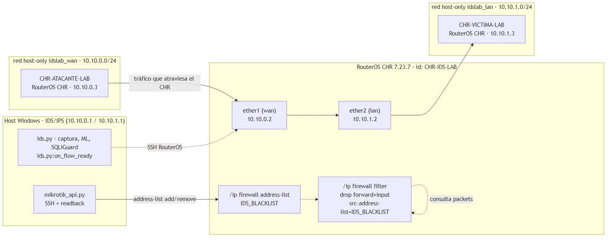
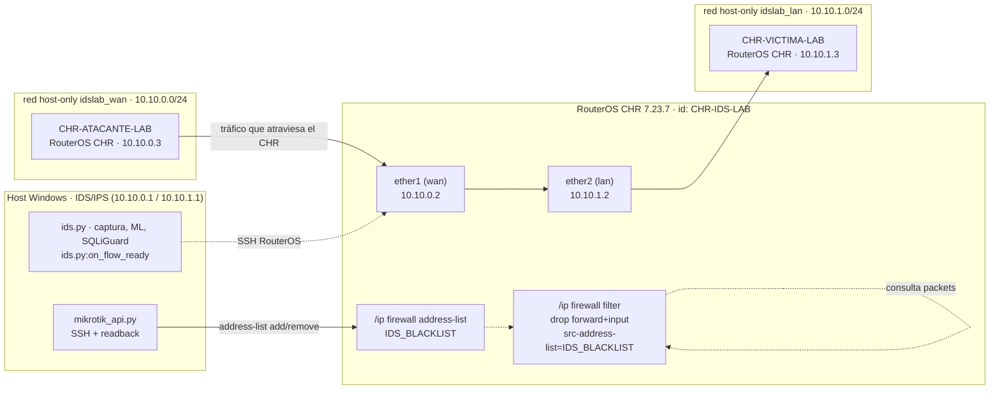
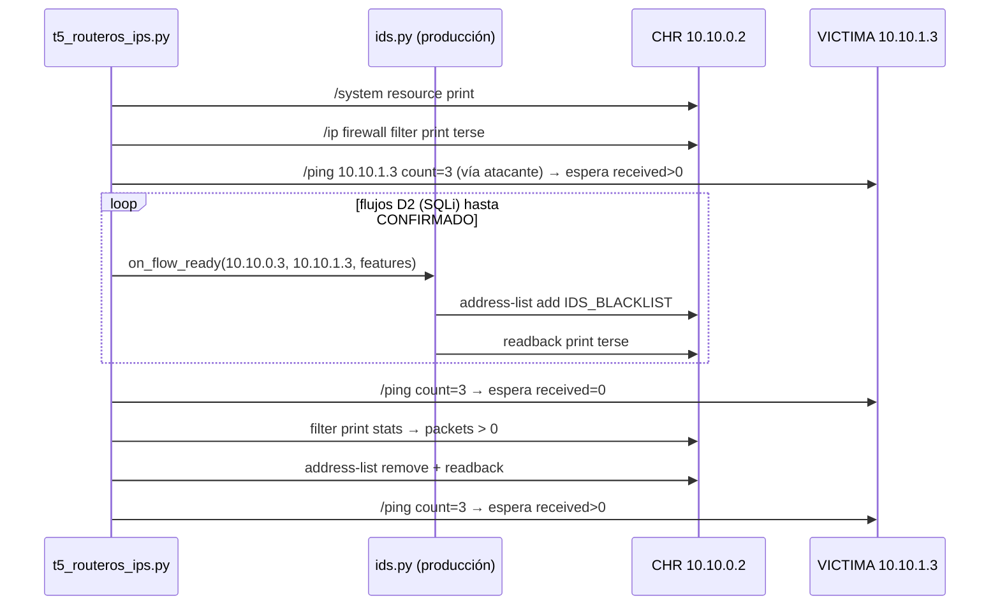

# Topología del laboratorio virtual

Réplica aislada de la red de UNIPAZ para validar el IPS sin afectar producción.
Ninguna VM usa red física: las tres se comunican por **dos adaptadores host-only**
de VirtualBox, así que ningún paquete sale a la red de la universidad.

Los tres nodos son **RouterOS CHR 7.23.7**: atacante y víctima son clones del
disco del router, lo que evita por completo la consola manual, la ISO de
instalación y la necesidad de internet para montar el laboratorio.

## Diagrama



Este mismo diagrama en [SVG](topologia-lab.svg), por si hay que imprimirlo o
escalarlo sin perder nitidez. El código fuente sigue abajo, que es lo que se
edita si algún día cambia la topología:



## Plan de direcciones (fijo)

| Nodo | Interfaz | IPv4 | Gateway | DNS |
|---|---|---|---|---|
| Host (IDS/IPS) | `VirtualBox Host-Only #wan` | `10.10.0.1/24` | — | — |
| Host (IDS/IPS) | `VirtualBox Host-Only #lan` | `10.10.1.1/24` | — | — |
| CHR | `ether1` (wan) | `10.10.0.2/24` | — | — |
| CHR | `ether2` (lan) | `10.10.1.2/24` | — | — |
| Atacante | `ether1` (wan) | `10.10.0.3/24` | `10.10.0.2` | — |
| Víctima | `ether2` (lan) | `10.10.1.3/24` | `10.10.1.2` | — |

Ambas subredes son **directamente conectadas** en el CHR: no hacen falta rutas
estáticas ni NAT. Los tres nodos ejecutan el **mismo software** (RouterOS CHR
7.23.7); el atacante tiene una sola NIC (wan) y la víctima usa su `ether2` (lan),
de modo que todo su tráfico pasa por el RouterOS — que es exactamente lo que el
IPS necesita para cortar el paso.

### Por qué la víctima conserva una NIC deshabilitada

Víctima y atacante son **clones** del disco CHR del router (gold image, en
`_lab/chr-gold-lab.vmdk`), así que arrancan con la configuración de este:
`ether1 = 10.10.0.2` y `ether2 = 10.10.1.2`. Como el host entra a esa red por
`10.10.0.1`, la `ether1` de la víctima **debe** quedar conectada a `wan` mientras
se reasigna su dirección; si se desconectara, RouterOS renombraría `ether2` a
`ether1` y el plan de IPs quedaría desalineado. Por eso `chr_apply_config.py`
termina deshabilitándola por software (`disabled=yes`) en vez de retirarla
físicamente: el nombre de la interfaz no cambia y sigue sin ser un camino
alterno hacia el laboratorio. `verificar_lab.py` lo comprueba antes de T5.

### Por qué los clones comparten las MACs del router

RouterOS identifica las interfaces `ether` por **MAC, no por posición**: un clon
cuyas NICs nazcan con MACs desconocidas no reconoce `ether1`/`ether2`, sus
direcciones heredadas quedan en interfaces que el host no ve y el nodo queda
inalcanzable sin consola. Por eso `provision_chr.ps1` da a los clones las mismas
MACs que el router (`08:00:27:49:7F:9C` y `08:00:27:D2:A1:09`).

El duplicado no se puede corregir después: RouterOS 7 rechaza
`/interface set ether1 mac-address=...` con `bad parameter` porque la MAC la impone
el hardware, y la única ventana para fijarla es antes del primer arranque, que es
justo cuando el clon todavía no tiene `ether1`/`ether2`.

Que el duplicado no rompa la conmutación **se midió, no se supuso**: con las tres
VMs encendidas, 30 pings host → atacante y 30 atacante → router dieron **0 % de
pérdida**. `chr_apply_config.py` verifica las MACs reales contra las de la gold
image en cada corrida.

> [!NOTE]
> Las IPs son fijas porque el kit y T5 las tienen fijas en el código. Cambiarlas
> obliga a tocar `provision_chr.ps1`, `_lab/nodos.json`, `chr_apply_config.py`
> y las constantes `ATACANTE` / `VICTIMA` de `t5_routeros_ips.py`.

## Configuración del CHR aplicada por `chr_apply_config.py`

El script tiene un registro de nodos (`--listar` lo imprime) y se invoca por rol:
`--nodo router`, `--nodo atacante`, `--nodo victima`.

### Router (`--nodo router`)

```
/ip address add address=10.10.0.2/24 interface=ether1
/ip address add address=10.10.1.2/24 interface=ether2
/system identity set name=CHR-IDS-LAB
/ip firewall address-list remove [find list="IDS_BLACKLIST"]
/ip firewall filter remove [find comment="IDS_BLACKLIST_DROP_FORWARD"]
/ip firewall filter remove [find comment="IDS_BLACKLIST_DROP_INPUT"]
/ip firewall filter add chain=forward action=drop src-address-list="IDS_BLACKLIST" \
    comment="IDS_BLACKLIST_DROP_FORWARD" place-before=0
/ip firewall filter add chain=input action=drop src-address-list="IDS_BLACKLIST" \
    comment="IDS_BLACKLIST_DROP_INPUT" place-before=0
```

### Atacante y víctima (`--nodo atacante` / `--nodo victima`)

La reasignación se hace **en dos fases**, porque cambiar la IP de un nodo al que
se entra por SSH corta la sesión:

| Fase | Nodo | Acciones |
|---|---|---|
| A | atacante | quita cualquier dirección fuera de `10.10.0.0/24`, agrega `10.10.0.3/24` en la interfaz wan, ruta por defecto `10.10.0.2`, identidad `CHR-ATACANTE-LAB` |
| B | atacante | elimina `10.10.0.2/24` (la heredada del clon) |
| A | víctima | elimina `10.10.1.2/24`, agrega `10.10.1.3/24` en la interfaz lan, ruta por defecto `10.10.1.2`, identidad `CHR-VICTIMA-LAB` |
| B | víctima | elimina `10.10.0.2/24` y ejecuta `/interface set ether1 disabled=yes` |

La fase B solo se lanza cuando la IP final ya responde por SSH. Si no responde,
el script **aborta sin limpiar** la dirección de bootstrap: borrarla a ciegas
dejaría el nodo inalcanzable y sin forma de arreglarlo sin consola.

`place-before=0` sitúa el drop por delante de cualquier regla previa, y el script
elimina y recrea las reglas en cada corrida (idempotente).

### Por qué hacen falta las dos reglas

Añadir la IP a `IDS_BLACKLIST` **no bloquea nada por sí solo** en RouterOS: el
address-list es solo un conjunto de nombres. El corte real lo hace la regla de
`filter`:

| Regla | Efecto | Verificado por T5 |
|---|---|---|
| `IDS_BLACKLIST_DROP_FORWARD` | el atacante deja de alcanzar a la víctima | gate `post_ping_denegado` + `drop_forward_stats` |
| `IDS_BLACKLIST_DROP_INPUT` | corta además el tráfico dirigido al propio router | control (no verificado por T5) |

## Cadena que ejecuta T5



La detección entra por `ids.on_flow_ready` —**la misma ruta de producción**—, solo
que alimentada con features reales de `D2_test.csv` y la IP del atacante del lab
(`10.10.0.3`), para que el bloqueo caiga sobre la VM y no sobre producción.

> [!IMPORTANT]
> El ping se hace con `/ping <ip> count=3` de RouterOS y el veredicto sale de
> `sent=… received=…`, **no del código de salida**: RouterOS devuelve `rc=0`
> incluso cuando no llega ningún paquete, de modo que un wrapper que solo mire
> `rc` daría el gate `post_ping_denegado` por bueno con el ataque activo y sin él.
> Implementación: `nodos_lab.ping_nodo()`.

## Requisitos de capacidad

| Recurso | Necesario | Motivo |
|---|---|---|
| RAM | ~1,5 GB de invitados | 3 × CHR 512 MB |
| Disco | ~200 MB | 3 discos CHR (~45 MB el original + clones) |
| CPU | 1 vCPU por VM | CHR no necesita más |

Ejecutable tanto en el host de producción como en otra máquina: la red del
laboratorio es 100 % virtual (host-only), por lo que no interfiere con el tráfico
real del campus mientras las VMs estén apagadas.