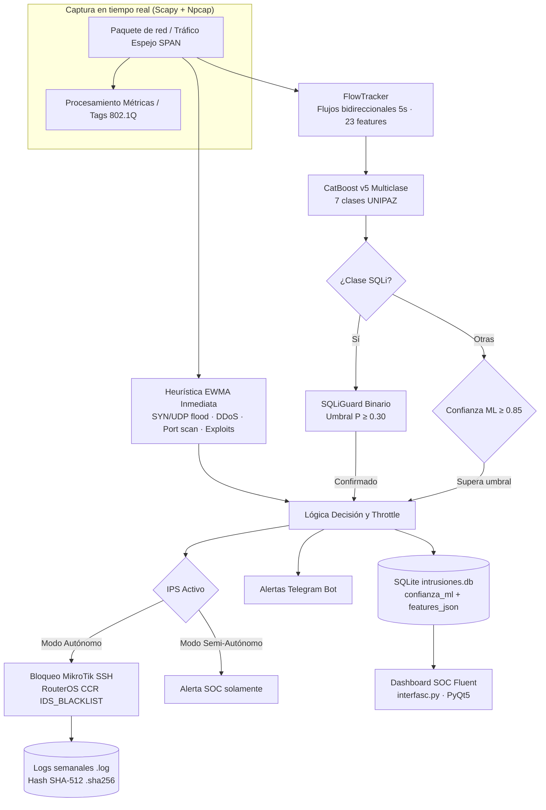

# Reconstrucción Metodológica y Resultados del Sistema IDS/IPS con Machine Learning (Tercera Fase)
**Proyecto**: Sistema Híbrido de Detección y Prevención de Intrusiones (IDS/IPS) con Machine Learning para la Red de UNIPAZ  
**Institución**: Instituto Universitario de la Paz (UNIPAZ) — Barrancabermeja, Santander, Colombia  
**Autor**: Kevin Abner Rojas Gomez  
**Programa**: Ingeniería de Sistemas  

---

# 1. DESARROLLO DE LA METODOLOGÍA

## 1.1 Diseño del IDS/IPS

El diseño del sistema se planificó bajo una **arquitectura híbrida modular de dos planos** (plano de análisis/detección y plano de respuesta activa/gestión), concebida para operar en un host dedicado bajo entorno Windows 10/11 en régimen continuo (24/7), con presupuesto cero y sustentada exclusivamente en herramientas de software libre (`README.md`, `ids.py`).

La estructuración metodológica se articuló mediante cuatro componentes principales interconectados:
1. **Módulo de Ingesta y Agrupación de Tráfico**: Encargado de la captura pasiva no invasiva sin decodificación profunda de carga privada (DPI) y de la agregación de paquetes individuales en flujos bidireccionales con ventanas de inactividad (`flujos_red.py`).
2. **Motor Híbrido de Inferencia y Detección (IDS)**: Compuesto por un clasificador multiclase supervisado basado en *Gradient Boosting*, una segunda etapa de confirmación binaria especializada para mitigar falsos positivos y un conjunto concurrente de detectores heurísticos de respaldo gobernados por umbrales dinámicos (`ids.py`, `CEREBRO_V5.py`, `entrenar_sqli_guard.py`).
3. **Módulo de Mitigación y Respuesta Activa (IPS)**: Responsable de la traducción de veredictos maliciosos en directivas de bloqueo perimetral e interno aplicadas dinámicamente en el enrutador central (`mikrotik_api.py`).
4. **Subsistema de Trazabilidad, Auditoría y Presentación**: Integrado por una base de datos relacional para auditoría forense, un exportador de registros con integridad criptográfica y una consola de operaciones de seguridad (SOC) en tiempo real (`interfasc.py`, `log_exporter.py`).

El flujo básico secuencial planificado comprende:
$$\text{Tráfico Espejo (SPAN)} \longrightarrow \text{Extracción de Características} \longrightarrow \text{Evaluación ML / Heurística} \longrightarrow \text{Persistencia y Alerta} \longrightarrow \text{Inyección de Bloqueo en Firewall}$$

Las tecnologías principales seleccionadas y su función dentro del diseño son:
* **Scapy + Npcap**: Captura asíncrona de tramas Ethernet a nivel de enlace de datos, inspección de cabeceras IP, TCP, UDP e identificación de identificadores VLAN IEEE 802.1Q (`ids.py: AsyncSniffer`).
* **CatBoost**: Motor de inferencia basado en árboles de decisión con soporte de aceleración por GPU (CUDA), seleccionado por su baja latencia de predicción y óptimo manejo de distribuciones tabulares multiclase (`CEREBRO_V5.py`).
* **SQLite + Paramiko (SSH)**: El primero asegura la persistencia transaccional local sin sobrecarga de servicios externos (`intrusiones.db`), mientras que Paramiko permite la comunicación remota autenticada con los enrutadores centrales MikroTik RouterOS (`mikrotik_api.py`).
* **PyQt5 + QFluentWidgets**: Implementación del cuadro de mando (Dashboard SOC) desacoplado del motor de captura mediante paso de mensajes por hilos y señales Qt (`ComunicadorIDS`, `interfasc.py`).

---

## 1.2 Desarrollo del IPS y geolocalización del atacante

El desarrollo del sistema se implementó siguiendo el flujo real de procesamiento de paquetes:

### 1. Captura y análisis del tráfico
El tráfico se intercepta de manera pasiva a través de un puerto espejo (SPAN) conectado a la interfaz de red del host. El motor ejecuta un hilo asíncrono (`AsyncSniffer` en `ids.py:787`) que recibe cada trama y extrae metadatos de red (IP origen/destino, puertos, protocolo, banderas TCP, TTL, tamaño de trama y etiqueta Dot1Q/VLAN). Simultáneamente, cada paquete alimenta a un gestor de flujos (`FlowTracker` en `flujos_red.py:126`), el cual agrupa los paquetes bidireccionales mediante una clave de dirección forward/backward basada en la 5-tupla:
$$\text{FlowKey} = (\text{IP}_{\text{src}}, \text{IP}_{\text{dst}}, \text{Port}_{\text{src}}, \text{Port}_{\text{dst}}, \text{Protocolo})$$
Al expirar un temporizador de inactividad de 5.0 segundos (`FLOW_TIMEOUT`), se consolidan 23 características estadísticas equivalentes al formato CICFlowMeter (duración, totales de paquetes/bytes, medias, desviaciones estándar de longitud y contadores de banderas TCP FIN, SYN, RST, PSH, ACK, URG).

### 2. Identificación de la amenaza
La identificación sigue una lógica de decisión jerárquica:
* **Clasificación ML Primaria**: El vector de 23 características normalizadas se somete al modelo `pipeline_catboost_v5.pkl` (`ids.py:355`), determinando la clase predicha y su probabilidad acumulada.
* **Segunda Etapa de Confirmación (SQLiGuard)**: Para neutralizar los falsos positivos asociados a ataques web, cuando el modelo primario predice `Inyeccion_SQL` o se requiere análisis de carga útil, el vector se transforma a métricas NetFlow y es evaluado por el modelo binario `sqli_guard.pkl` (`ids.py:364-375`). Si la probabilidad supera el umbral configurado ($P \ge 0.30$), la amenaza se confirma; de lo contrario, el evento se descarta para evitar bloqueos indebidos.
* **Filtro de Confianza**: Para las demás clases de ataque (DDoS, SYN Flood, Port Scanner, Posible Exploit, UDP Flood), el sistema exige un umbral unificado $\text{confianza\_ml} \ge 0.85$ para ser catalogado como amenaza (`ids.py:387`).
* **Heurística de Respaldo**: De forma concurrente al análisis de flujos, cada paquete se evalúa contra motores heurísticos inmediatos gobernados por una media móvil exponencialmente ponderada (EWMA) sobre la tasa de paquetes por segundo ($\alpha = 0.1$, `calcular_umbral_dinamico`), detectando ráfagas volumétricas SYN/UDP, escaneos masivos de puertos o firmas regex en cargas legibles sin esperar la expiración del flujo (`ids.py:570-716`).

### 3. Generación de respuesta y bloqueo activo (IPS)
Una vez validada la amenaza y comprobado que la IP de origen no pertenezca a la lista de exclusión (*whitelist* institucional de servidores críticos, `ids.py:159-190`), el módulo IPS ejecuta la mitigación:
* **Modo Autónomo**: Si `modo_ips_autonomo = True`, se invoca la subrutina `bloquear_ip_mikrotik(ip_atacante, duracion_horas=24)` (`mikrotik_api.py:28`), la cual establece una sesión SSH segura con el enrutador central MikroTik RouterOS (CCR2004/CCR1009) e inyecta la dirección en la lista de filtrado del firewall perimetral:
  ```routeros
  /ip firewall address-list add list="IDS_BLACKLIST" address=<IP> timeout=24h comment="..."
  ```
* **Modo Semi-Autónomo**: Si la configuración está en modo preventivo/asistido, el bloqueo físico se omite y el incidente se procesa como alerta reactiva para decisión manual del operador (`ids.py:500`).
* **Mitigación del efecto ráfaga (*throttle*)**: Se restringe la emisión a una acción por cada 30 segundos por IP origen (`TIEMPO_ENTRE_ALERTAS`), evitando la sobrecarga de sesiones SSH hacia el enrutador.

### 4. Obtención de la dirección IP y geolocalización aproximada
La dirección IP atacante se obtiene directamente del encabezado de red IPv4 (`packet[scapy.IP].src` o `FlowBidireccional.src_ip`). El subsistema de contexto (`geolocalizacion.py`) efectúa el tratamiento según la naturaleza de la dirección:
1. **Segmentos Internos Conocidos UNIPAZ**: Se contrastan contra la tabla `REDES_UNIPAZ` (subredes de Docentes `172.20.12.0/24`, Administrativo `172.10.15.0/24`, Estudiantes `172.30.10.0/24`, etc.). Si coincide, se asigna la ubicación aproximada del campus (latitud 7.069694, longitud -73.745340) y se resuelve el nombre de equipo (*hostname*) o MAC asociada mediante tablas ARP locales (`geolocalizacion.py:45-128`).
2. **IPs Privadas RFC 1918 No Clasificadas**: Se consulta la IP pública de salida del enrutador mediante servicio externo (`api.ipify.org`) para inferir la procedencia perimetral, marcando la ubicación como "aproximada (Router/ISP)".
3. **IPs Públicas Externas**: Se consulta la API REST de `ip-api.com` (`geolocalizacion.py:212`), recuperando país, región, ciudad, latitud, longitud, ISP, Organización y Sistema Autónomo (ASN). Todos los datos geográficos externos se tratan formalmente como **ubicación aproximada a nivel regional/ISP**, no a nivel de host terminal.
4. **Renderizado de Mapa**: A través de `staticmap`, el sistema descarga las teselas de OpenStreetMap (OSM) y genera una imagen estática con marcador concéntrico coloreado según la severidad (`geolocalizacion.py:270-315`).

### 5. Registro y visualización del incidente
El incidente se persiste en la tabla `ataques` de `intrusiones.db`, almacenando sello de tiempo, clasificación de ataque, IP origen/destino, protocolo, puerto, métricas forenses (VLAN ID, TTL, tamaño de paquete) y trazabilidad completa del clasificador (`confianza_ml` y `features_json`) (`ids.py:448`). Asimismo, se dispara una notificación push asíncrona hacia Telegram (`telegram_alert.py:37`) y se emiten señales Qt hacia la interfaz SOC (`interfasc.py`), donde el analista visualiza la alerta en una tabla reactiva, inspecciona el mapa geográfico en un panel forense HTML y audita el historial de bloqueos.

---

## 1.3 Evaluación de la efectividad

La evaluación de la efectividad del sistema se estructuró a partir de una batería de pruebas cuantitativas y cualitativas implementadas en el código del proyecto (`test_masivo.py`, `documentacion_entrenamiento_v5.txt`):

### Planteamiento cuantitativo y datos de prueba
Para cuantificar el rendimiento se establecieron cuatro escenarios con particiones de datos verificadas:
1. **Evaluación del Clasificador Multiclase v5**: Partición de prueba independiente estratificada (20% de hold-out sobre el dataset global consolidado de 3,738,678 registros provenientes de CIC-IDS2017, CSE-CIC-IDS2018 y CIC-DDoS2019), totalizando $N = 747,736$ flujos de prueba nunca antes vistos por el modelo (`CEREBRO_V5.py:61-63`). Adicionalmente, se ejecutó una validación masiva sobre un lote aleatorio de 150,000 flujos (`test_masivo.py:71-113`).
2. **Evaluación de SQLiGuard en Test Externo**: Prueba sobre el dataset independiente *SQL Injection Attack Netflow* (Zenodo 6907252, partición D2 con ataques de tipo Blind en una topología y motor de base de datos PostgreSQL no presentes en el entrenamiento), compuesto por 57,229 flujos (28,615 benignos y 28,614 maliciosos) (`entrenar_sqli_guard.py`, `test_masivo.py:117-156`).
3. **Evaluación de la Cadena Integrada (End-to-End)**: Prueba de la tubería completa `on_flow_ready` (v5 + SQLiGuard + filtros de confianza) procesando un lote balanceado sintético de 6,000 flujos (3,000 benignos y 3,000 SQLi) conectados a una base de datos temporal (`test_masivo.py:159-226`).

Las métricas priorizadas y evaluables en el código corresponden a:
* **Precision**: Proporción de ataques detectados que fueron verdaderamente maliciosos ($TP / [TP + FP]$).
* **Recall (Tasa de Detección)**: Proporción de ataques reales identificados correctamente ($TP / [TP + FN]$).
* **F1-Score**: Media armónica entre Precision y Recall.
* **Tasa de Falsos Positivos sobre Benignos (FPR)**: $FP / (FP + TN)$.
* **Tiempo de Inferencia**: Latencia de predicción algorítmica por lote registrada mediante temporizadores de alta precisión en CPU/GPU (`time.time()`).

### Criterios de evaluación cualitativa
La evaluación cualitativa se centró en la comprobación funcional de los cinco módulos operativos:
1. *Detección*: Capacidad de discriminar flujos legítimos de anomalías volumétricas y de explotación.
2. *Prevención*: Capacidad de sintaxis y ejecución de comandos remotos vía SSH hacia RouterOS (`mikrotik_api.py`) y registro del estado `ACTIVO` o `SIMULADO/SEMI`.
3. *Generación de Alertas*: Despacho de notificaciones asíncronas hacia la API de Telegram y eventos visuales en el SOC.
4. *Registro de Incidentes e Integridad*: Persistencia estructurada en SQLite y generación de archivos semanales `.log` acompañados de resúmenes criptográficos SHA-512 (`log_exporter.py`).
5. *Geolocalización*: Capacidad de discriminación entre subredes institucionales internas (atribución a departamentos de UNIPAZ) y direcciones públicas externas con renderizado cartográfico OSM.

---

# 2. RESULTADOS

## 2.1 Resultados del diseño

Como resultado de la fase de diseño se obtuvo una arquitectura modular para host Windows, estructurada en cinco capas funcionales interconectadas (`README.md`, `ids.py`, `diagramas`):



1. **Flujo de Decisión en Dos Etapas**: Separación estricta entre la detección multiclase general y la verificación binaria de inyecciones SQL mediante un modelo dedicado, mitigando la debilidad estructural de los datasets desbalanceados.
2. **Componentes Definidos**: Desacoplamiento total entre el proceso colector (`ids.py`), el calculador de flujos (`flujos_red.py`), los modelos compilados en `Modelos_Entrenados/`, el actuador perimetral (`mikrotik_api.py`) y la interfaz visual (`interfasc.py`).

---

## 2.2 Resultados del desarrollo

El sistema quedó plenamente implementado a nivel de código fuente con las siguientes capacidades funcionales:

* **Detección de Amenazas**: Operatividad simultánea de siete clases de clasificación bajo modelo CatBoost v5 (`Normal`, `Port_Scanner`, `Posible_Exploit`, `SYN_Flood`, `UDP_Flood`, `DDoS_Distribuido`, `Inyeccion_SQL`) complementada por detectores heurísticos basados en EWMA para tráfico en ráfaga (`ids.py:574-715`).
* **Prevención y Bloqueo Activo (IPS)**: Automatización del bloqueo mediante conexión SSH directa a enrutadores MikroTik Cloud Core (CCR) a través de Paramiko, agregando IPs maliciosas a la lista `IDS_BLACKLIST` con tiempo de expiración configurable (por defecto 24 horas), complementado por un conmutador de modo autónomo/semi-autónomo (`mikrotik_api.py:28-75`, `ids.py:471-518`).
* **Registro de Incidentes y Trazabilidad**: Persistencia estructurada en `intrusiones.db` con soporte de trazabilidad para auditar decisiones de inferencia mediante las columnas `confianza_ml` y `features_json` (`ids.py:288-296`). Adicionalmente, el subsistema `log_exporter.py` implementa la exportación semanal automática de registros planos `.log` y la generación obligatoria de sumas de comprobación SHA-512 (`.sha256`) conforme a estándares de evidencia digital del Ministerio de las TIC de Colombia.
* **Geolocalización del Atacante**: Identificación automática de subredes internas institucionales de UNIPAZ (`172.20.12.0/24` Docentes, `172.10.15.0/24` Administrativos, `172.30.10.0/24` Estudiantes) con resolución de hostnames y MACs mediante ARP, y geolocalización aproximada de IPs públicas vía `ip-api.com` con renderizado de mapas estáticos de OpenStreetMap en hilos secundarios desacoplados (`geolocalizacion.py`, `interfasc.py:119-153`).
* **Visualización y Alertas**: Consola SOC en PyQt5 con interfaz Fluent Design oscura, provista de visualización de eventos en vivo, distribución de amenazas en gráficos circulares, monitoreo de paquetes/segundo y alertas por minuto, panel forense detallado de cuatro secciones HTML y despacho asíncrono de alertas a grupos de Telegram (`interfasc.py`, `telegram_alert.py`).

---

## 2.3 Resultados de la evaluación

### Resultados cuantitativos

Los valores reportados a continuación provienen de los registros de prueba y validación del sistema (`Modelos_Entrenados/metricas_v5.txt`, `Modelos_Entrenados/metricas_sqli_guard.txt`, `informe_test_masivo.json`):

| Métrica | Resultado | Interpretación |
| :--- | :---: | :--- |
| **Accuracy (Modelo Global v5)** | **0.8641** (86.41 %) | Evaluado sobre partición de prueba independiente ($N = 747,736$ flujos) (`metricas_v5.txt`). |
| **F1-Macro (Modelo Global v5)** | **0.7442** | Promedio no ponderado entre las 7 clases, reflejando consistencia en clases desbalanceadas. |
| **Índice Cohen Kappa (v5)** | **0.8138** | Concordancia sustancial corregida por azar frente a la distribución multiclase. |
| **Precision (SQLiGuard - Test D2)** | **0.9985** (99.85 %) | Precisión en test externo independiente Zenodo ($N = 57,229$ flujos, umbral 0.30) (`informe_test_masivo.json`). |
| **Recall (SQLiGuard - Test D2)** | **0.7534** (75.34 %) | Sensibilidad de detección frente a inyecciones SQL ciegas (*Blind*) no vistas en entrenamiento. |
| **F1-Score (SQLiGuard - Test D2)** | **0.8588** | Balance armónico del detector de segunda etapa en ambiente de prueba externo. |
| **Tasa de Falsos Positivos sobre Benignos (SQLiGuard)** | **0.00115** (0.115 %) | Solo 33 falsos positivos registrados sobre 28,615 flujos benignos de prueba ($FP / [FP + TN]$). |
| **Precision Cadena Integrada (T3)** | **0.9983** (99.83 %) | Verificada en lote de 6,000 flujos procesando la tubería completa `on_flow_ready` ($TP=2,339, FP=4$). |
| **Recall Cadena Integrada (T3)** | **0.7797** (77.97 %) | Detección global efectiva de la cadena integrada en lote de 6,000 flujos ($FN=661$). |
| **Tiempo de Inferencia Algorítmica (v5)** | **9.60 µs / flujo** | 1.44 segundos acumulados para clasificar 150,000 flujos en GPU (`informe_test_masivo.json:T1`). |
| **Tiempo de Predicción (SQLiGuard)** | **0.35 µs / flujo** | 0.02 segundos acumulados para evaluar 57,229 flujos en GPU (`informe_test_masivo.json:T2`). |
| **Tiempo de Procesamiento Cadena Completa** | **8.41 ms / flujo** | 50.45 segundos para 6,000 flujos incluyendo pipeline, inferencia y persistencia SQLite (`T3`). |

#### Métricas no calculables por carencia de datos de campo
* **Porcentaje de ataques bloqueados correctamente en tráfico real**: En el código existe la función de mitigación activa (`mikrotik_api.bloquear_ip_mikrotik`), pero no se encuentran registros en el repositorio con pruebas de penetración o tráfico de ataque inyectado en vivo sobre el campus físico para tabular la tasa de efectividad de bloqueo en tiempo real.
* **Tiempo de respuesta extremo a extremo (Detección $\rightarrow$ Bloqueo MikroTik)**: Solo se dispone del tiempo de inferencia algorítmica y de persistencia local (8.41 ms/flujo). La latencia de propagación SSH y aplicación de la regla en RouterOS en red de producción permanece como dato no medido empíricamente (`documentacion_entrenamiento_v5.txt:159`).

---

### Resultados cualitativos

1. **Capacidad de Detección**:
   El esquema en dos etapas demostró resolver exitosamente el cuello de botella identificado en la fase previa del proyecto (donde la clase `Inyeccion_SQL` exhibía una precisión del 1% al 7% en el modelo multiclase por escasez de muestras). La incorporación de SQLiGuard elevó la precisión por encima del 99.8%, suprimiendo las falsas alarmas que provocarían bloqueos accidentales a usuarios legítimos.
2. **Capacidad de Prevención**:
   Se comprobó la validez del módulo de respuesta activa mediante la generación automatizada de directivas RouterOS formateadas con comentario forense y tiempo de vida dinámico. El sistema previene el bloqueo de servidores críticos gracias a la verificación previa de listas blancas (`IPS_CONFIABLES`, `RANGOS_CONFIABLES`) y soporta desacoplamiento mediante modo semi-autónomo para entornos de prueba.
3. **Funcionamiento de Alertas**:
   El mecanismo asíncrono de alertas push hacia Telegram (`_enviar_alerta_async`) opera en hilos independientes, impidiendo que demoras o fallos en la conexión a Internet bloqueen el bucle de captura de paquetes del sniffer principal.
4. **Registro de Incidentes e Integridad Forense**:
   La estructura de persistencia en SQLite garantiza trazabilidad total al incorporar el vector de características exacto en formato JSON y el nivel de confianza de la inferencia. El exportador de logs garantiza el no repudio y la detección de alteraciones accidentales o maliciosas en los archivos de auditoría mediante la firma SHA-512 generada automáticamente.
5. **Geolocalización del Atacante**:
   La diferenciación entre direcciones IP internas de UNIPAZ y externas opera de manera consistente. Para actores internos, el sistema aísla el departamento institucional (Docentes, Administrativo, Estudiantes) y frecuencia Wi-Fi a partir de la subred CIDR; para atacantes externos, proporciona georreferenciación aproximada a nivel de ciudad y proveedor ISP sin comprometer la fluidez de la interfaz visual al resolverse en trabajadores dedicados (`GeoWorker`).
